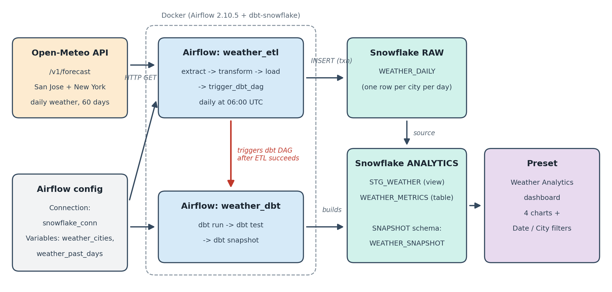

# Weather Prediction Analytics

DATA 226 Lab 1. An automated weather analytics pipeline built with **Snowflake**, **Apache Airflow**, **dbt** and **Preset**.

We pull daily weather for **San Jose** and **New York** from the Open-Meteo API, load it into Snowflake with Airflow, turn it into useful metrics with dbt, and show the results on a Preset dashboard.



## How it works

1. **`weather_etl`** (Airflow DAG, daily at 06:00 UTC)
   `extract` calls the Open-Meteo API for each city, `transform` flattens the JSON into rows, and `load` writes them into `RAW.WEATHER_DAILY` inside one SQL transaction. If anything fails, the load rolls back and raises the error, so reruns never create duplicates.
2. **`trigger_dbt_dag`** starts the dbt DAG only after the load succeeds.
3. **`weather_dbt`** (Airflow DAG) runs `dbt run`, `dbt test` and `dbt snapshot`.
4. **Preset** reads `ANALYTICS.WEATHER_METRICS` and shows it on the Weather Analytics dashboard.

## Metrics built in dbt

| Metric | Meaning |
|---|---|
| `temp_7day_avg` | 7-day moving average of the daily mean temperature |
| `temp_anomaly` | How far a day's temperature is from the city's average |
| `rainfall_7day` | Total rain over the last 7 days |
| `dry_spell_length` | Number of dry days in a row (less than 1 mm of rain) |

## Repository structure

```
weather-analytics-lab/
├── dags/
│   ├── weather_etl.py        Airflow ETL: Open-Meteo API to Snowflake
│   └── weather_dbt.py        Airflow DAG that runs dbt run, test and snapshot
├── dbt/
│   ├── dbt_project.yml
│   ├── profiles.yml          reads Snowflake credentials from env variables
│   ├── models/
│   │   ├── sources.yml
│   │   ├── schema.yml        dbt tests
│   │   ├── staging/stg_weather.sql
│   │   └── analytics/weather_metrics.sql
│   └── snapshots/weather_snapshot.sql
├── sql/
│   └── snowflake_setup.sql   creates the database, schemas and raw table
├── screenshots/              Airflow, dbt and Preset screenshots
├── Dockerfile                Airflow image with the Snowflake provider and dbt
├── docker-compose.yaml
└── README.md
```

## Setup

**1. Snowflake.** Run `sql/snowflake_setup.sql` in a Snowflake worksheet. It creates `WEATHER_DB` with the `RAW`, `ANALYTICS` and `SNAPSHOT` schemas.

**2. Start Airflow.**

```bash
docker compose build
docker compose up airflow-init
docker compose up -d
```

Open http://localhost:8081 and log in with `admin` / `admin`.

**3. Add the Airflow connection.** Go to **Admin > Connections** and add:

| Field | Value |
|---|---|
| Connection Id | `snowflake_conn` |
| Type | Snowflake |
| Login / Password | your Snowflake user |
| Schema | `RAW` |
| Account, Warehouse, Database, Role | your Snowflake details |

**4. Add the Airflow variables.** Go to **Admin > Variables** and add:

| Key | Value |
|---|---|
| `weather_cities` | `[{"name": "San Jose", "latitude": 37.3382, "longitude": -121.8863}, {"name": "New York", "latitude": 40.7128, "longitude": -74.0060}]` |
| `weather_past_days` | `60` |

**5. Run it.** Turn on both `weather_etl` and `weather_dbt`, then trigger `weather_etl`. The dbt DAG starts on its own when the ETL finishes.

## Dashboard

The Preset dashboard **Weather Analytics** uses the `ANALYTICS.WEATHER_METRICS` dataset and has four charts:

- 7-Day Avg Temperature
- 7-Day Rolling Rainfall
- Dry Spell Length
- Temperature Anomaly

It also has **Date Range** and **City** filters.

## Tools

Apache Airflow 2.10.5, dbt-core 1.12 with dbt-snowflake 1.9, Snowflake, Preset, Docker, Open-Meteo API.

## Team

- [Name 1]
- [Name 2]
